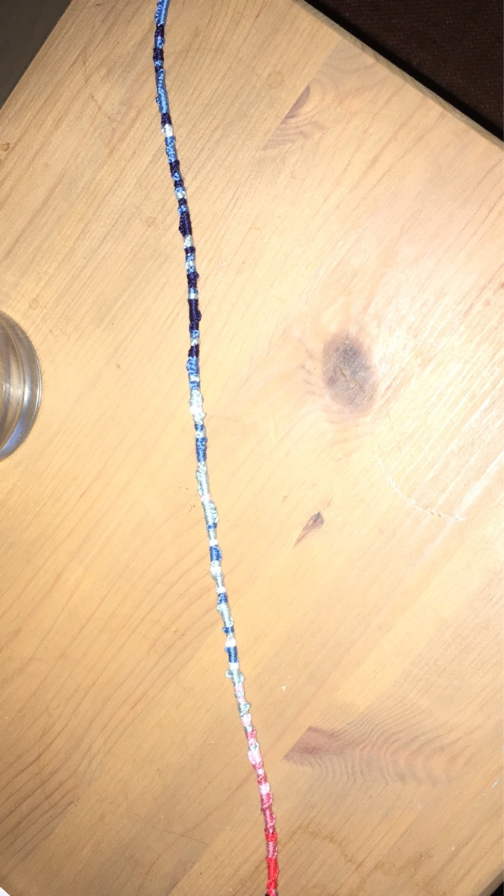
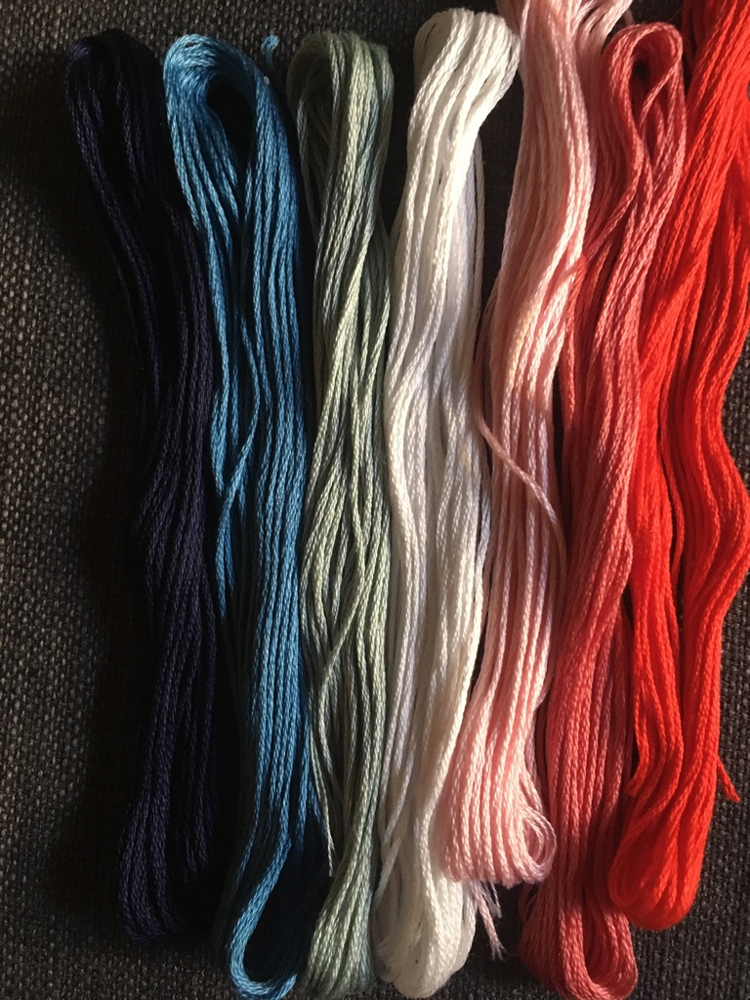
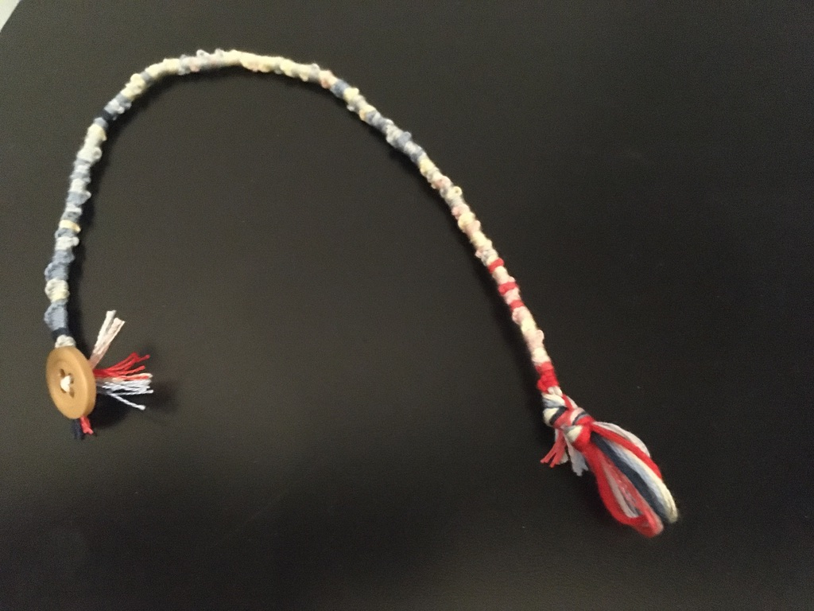

### Instructions are provided for a few examples of the observed temperature timeseries globally, or averaged over some location like the whole U.S. or California.

#### [Here are the instructions for the global mean.](globalMeanInstructions.md)
#### [And the U.S. mean.](usInstructions.md)
#### [And California.](caliInstructions.md)

One knot involves tieing the given color string around all the others *twice*. Two arm-lengths for each color is plenty. Some will be used more than others.

You can use the Jupyter Notebook to generate bracelet instructions for any country or U.S. state average observed temperature trend.

Just manually edit to the country or state code of your choosing. You can change the number of discrete colors, but I find that 7 is a good number for doing friendship bracelets. 

You'll need to get the observed temperature anomaly data file for gistemp or similar, if you're running the script yourself.
https://data.giss.nasa.gov/pub/gistemp/gistemp1200_GHCNv4_ERSSTv5.nc.gz
https://data.giss.nasa.gov/pub/gistemp/gistemp250_GHCNv4.nc.gz

#### I originally made this friendship bracelet template for a party as a fundraiser for my CA Climate Expedition bike ride this summer (2020). You can [donate here](https://ce2020.funraise.org/fundraiser/naomi-goldenson), if you feel inspired.

_-_Climate_Lab_Book_(Ed_Hawkins).png "Warming Stripes Graphic")

Hat tip to Ed Hawkins for [creating the Warming Stripes visualization idea!]:(http://www.climate-lab-book.ac.uk/2018/warming-stripes/)
